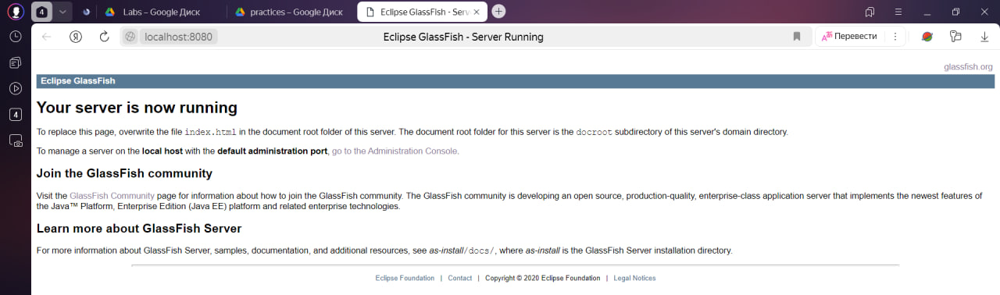
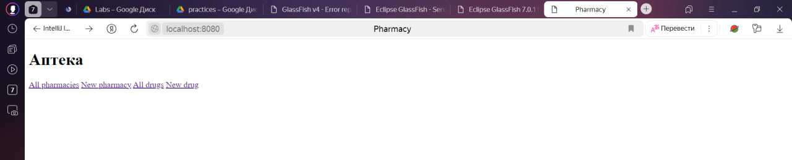

# Лабораторная Работа №1
Сервер приложений, использующийся в работе - **GlassFish**. Использовался для работы со спецификациями Java EE.
Jakarta EE — набор спецификаций для языка Java был подгружен автоматически средствами среды разработки IntelliJ IDEA.

**Перейдем к работе с базой данных:**

Аннотации (@Entity) и (@Table) были использованы для обозначения сущностей БД.

Сущности и связи имеют общих предков (BaseLinc и BaseEntity)

Для работы с сущностями были были написаны 2 сервиса, один из которых работает с таблицей аптек и лекарств, другой только с лекарствами.

Для организации обмена данными с клиентской и серверной частью приложения были написаны сервлеты, они позволяют организовать доступ к (JSP)страницам всех аптек, всех лекарств, страницам создания лекарств и аптек, странице просмотра сведений о конкретной аптеке.

###Примеры запуска программы

глассфиш наконец-то запустился...

развернули