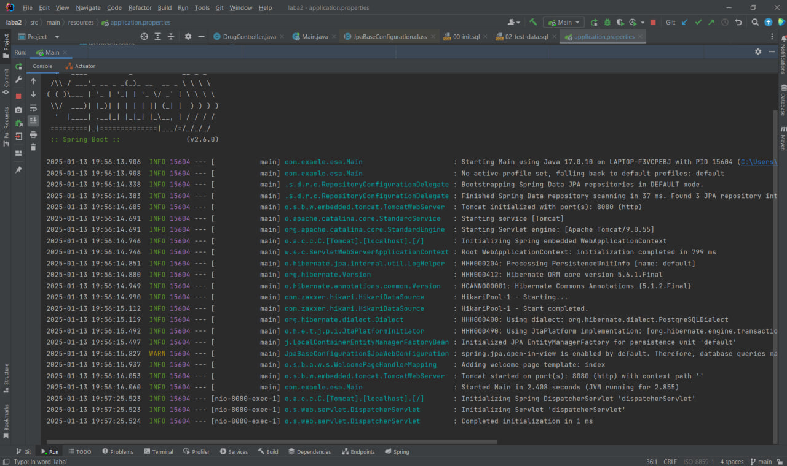
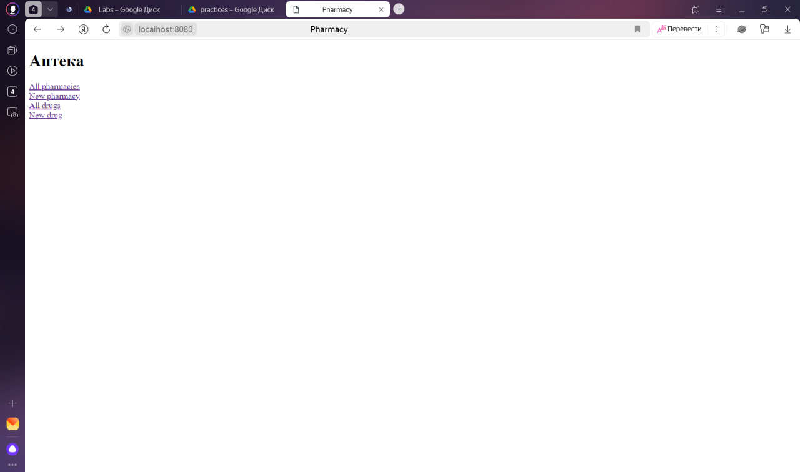
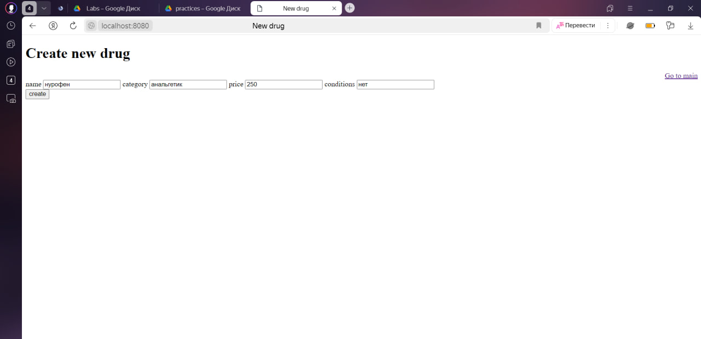
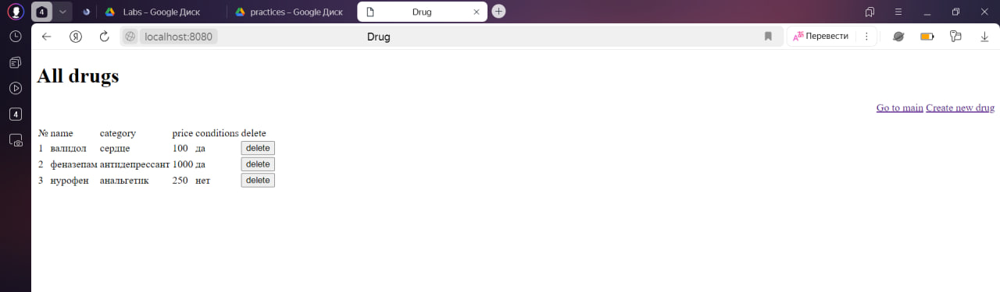
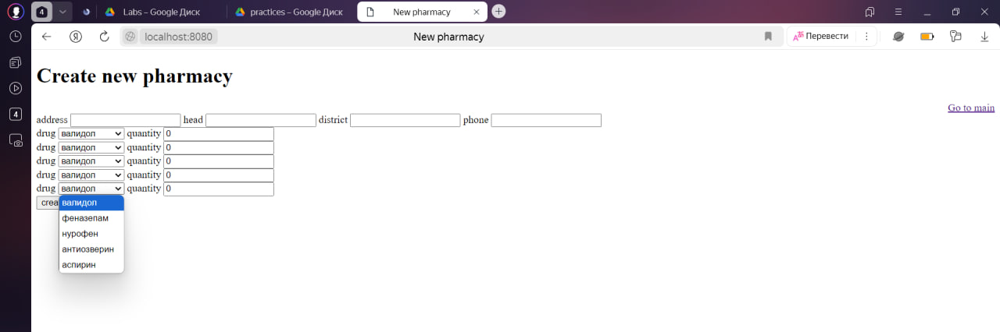
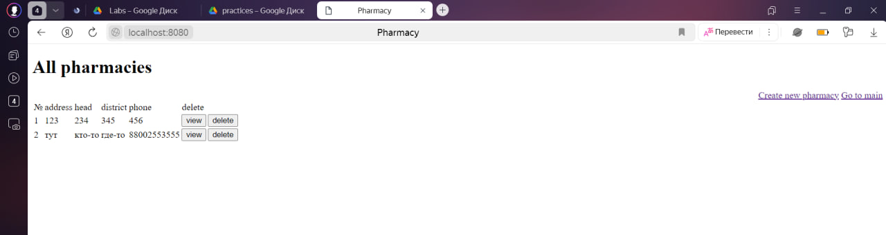
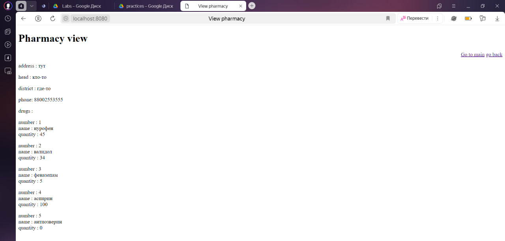

# Лабораторная Работа №2
Для реализации веб-приложения, был создан проект, включающий Spring Boot. Это расширение, которое позволяет упростить и ускорить работу со Spring.
Состав сущностей и логика программы аналогична предыдущей работе.
В этой лабораторной были применены аннотации:
**@GetMapping** - действует как ярлык для файлов @RequestMapping(method = RequestMethod.GET)
**@PostMapping** - действует как ярлык для файлов @RequestMapping(method = RequestMethod.POST).
Были реализованы методы производных запросов, автоматическое генерирование базовых запросов с помощью Spring (findBy, findAll).
Сервлеты в данной лабораторной работе заменены сервисами.
###Результаты лабораторной работы
Результаты лабораторной представлены ниже:

код наконец заработал

главная страница

страница создания лекарства

все лекарства

создание аптеки

все аптеки

обзор аптеки и лекарств в ней