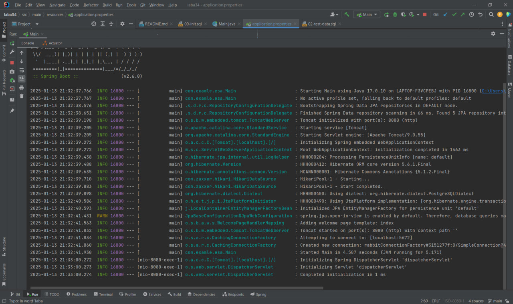
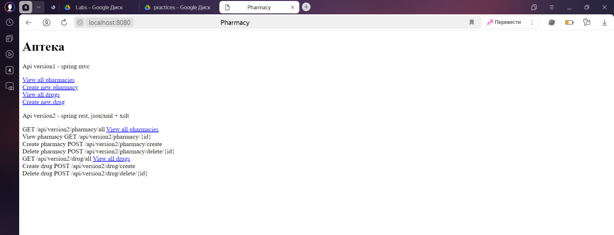
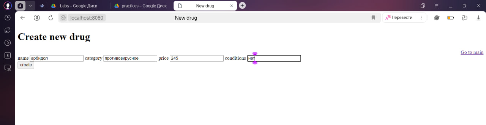
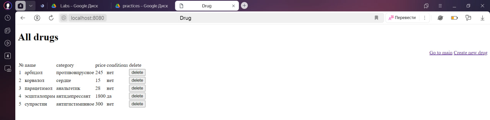
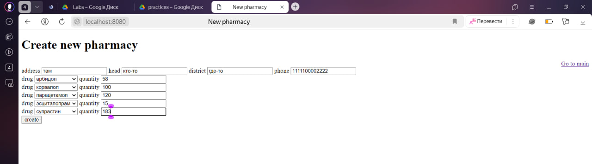
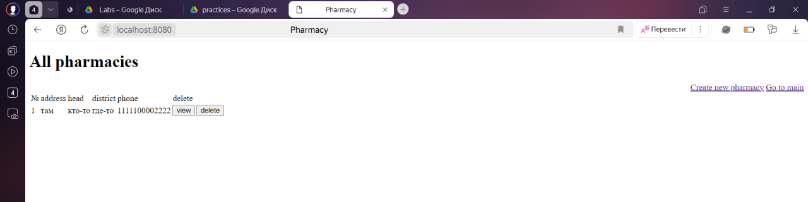
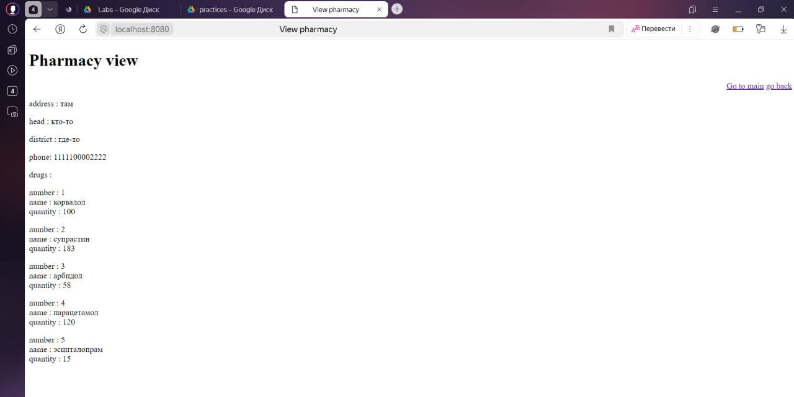

# Лабораторная работа №3

В первую очередь, в лабораторной работе были реализованы следующие API:

**GET:**
GET /api/version2/pharmacy/all
GET /api/version2/pharmacy/{id}
GET /api/version2/drug/all
GET /api/version2/drug/{id}
  
**POST:**
POST /api/version2/pharmacy/create
POST /api/version2/pharmacy/delete/{id}
POST /api/version2/drug/create
POST /api/version2/drug/delete/{id}

Для реализации RESTful приложения использовалась технология Spring REST.
Выбор в пользу этой технологии был сделан по нескольким причинам:
1) Данная технология является частью Spring Framework и тесно интегрирован с другими компонентами Spring, который использовался во второй лр.
2) Spring REST значительно упрощает процесс разработки и поддержки кода и предоставляет множество готовых решений и соглашений для упрощения задач, таких как обработка запросов, валидация данных и тд.

# Лабораторная Работа №4
 В рамках лабораторной работы были реализованы классы, которые выполняют следующие функции:
**Producer** - объект, создающий сообщения (LogEvent на создание и удаление), которые формируют несколько очередей (для ConsumerMail и ConsumerLog соответственно).

**ConsumerMail** - пробегает предзаполненную табличку с адресами и сверяет условия отправки сообщений (address, condition), если совпадение условий найдено при помощи метода из Mail Service производится отправка сообщения.

**ConsumerLog** - заполняет таблицу логов записями об изменениях.
###Результаты выполнения программы

Ниже представлены результаты лабораторной работы:
###Результаты лабораторной работы

код наконец заработал

главная страница

страница создания лекарства

все лекарства

создание аптеки

все аптеки

обзор аптеки и лекарств в ней